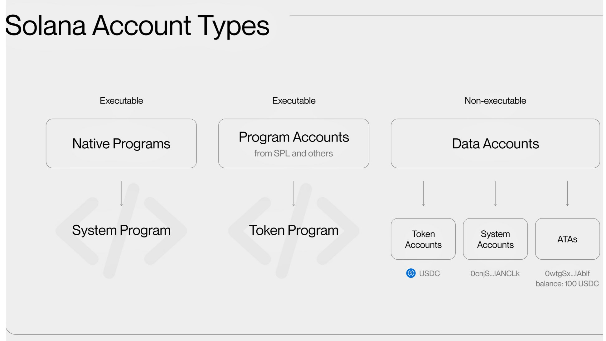
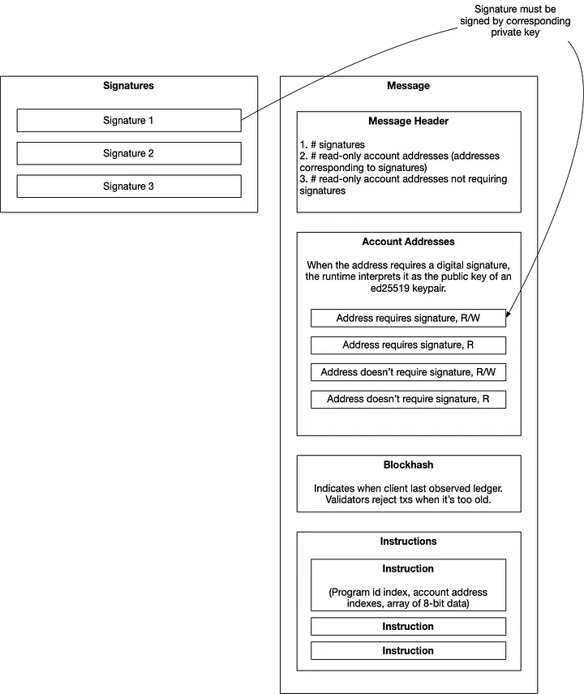

## Introduction

First off, what is Solana?

It's a blockchain platform that allows you to build decentralized applications. Supporting use cases like DeFi, NFTs, payments, gaming, and more.

Why Solana?

Solana is high-performance blockchain that is built for mass adoption. It is fast, scalable, secure, and energy efficient.

Solana achieves high performance through key innovations like Proof of History (PoH), Gulf Stream transaction forwarding, Sealevel parallel transaction processing, and Turbine block propagation. These enable theoretical throughput of up to 65k transactions per second with 400ms finality. Jump Crypto is actively working on a new validator client that is written from scratch in C, increasing transaction throughput upto 1M TPS.

Let's dive into the core concepts of Solana. If you're someone who is coming from Ethereum, refer to [Solana vs Ethereum](https://github.com/arrayappy/blog.md/blob/main/posts/solana/solana-vs-ethereum.md) for understanding key differences.

## Wallet

A crypto wallet is a software program or hardware device that allows you to store, send, and receive digital assets.

Each wallet has an address derived from a keypair. A keypair consists of:

- Public key (pubkey): Your wallet's address (a 32 byte [base58 encoded](https://en.wikipedia.org/wiki/Binary-to-text_encoding#Base58) string) that others can send assets to
- Secret key: Private key that controls your wallet - keep this secure!

Explorers like [Solana Explorer](https://explorer.solana.com/) and [Solscan](https://solscan.io/) allow you to view your wallet's address, transactions, and balances.

## Account

Accounts are records in the Solana ledger that either hold data or are an executable program. Each account will have an owner and only an owner can modify the account. All accounts can store `data` and `SOL`. Accounts are statically typed and have a fixed size (max 10MB).

> **What does an account contain? (Source: [Solana Docs](https://docs.solana.com/developing/programming-model/accounts))**
>
> - data: A byte array that stores the state of an account. If the account is a program (smart contract), this stores executable program code.
> - executable: A boolean flag that indicates if the account is a program.
> - lamports: A numeric representation of the account's balance in lamports, the smallest unit of SOL (1 SOL = 1 billion lamports).
> - owner: Specifies the public key (program ID) of the program that owns the account.

**Types of accounts:**

- Executable Accounts:
  - Native Programs - System Program, BPF Loader, Native Loader
  - Program Accounts - SPL Token Program & Other user programs
- Data Accounts:
  - System Accounts/Keypair Accounts - An account that contains a keypair.
  - PDA (Program Derived Address) - An account that is derived deterministically from a program's address and a seed phrase.
    - Token Mints
    - Token Accounts (ATAs)
    - NFT Accounts

**Account ownership:**

Each newly created data account is owned by a built-in program called the “System Program.” When you create account using `SystemProgram::CreateAccount` instruction, the System Program creates an account and then changes its owner to the current program. Even though, System Program owns accounts, it can only debit when the transaction is signed by the private key of that account.

All executable accounts are owned by BPF Loader. System Program and BPF Loader are owned by NativeLoader.

Sysvar accounts are special accounts that store data about cluster state. You can find list of sysvar accounts [here](https://docs.anza.xyz/runtime/sysvars).

**Solana has two types of storage:**

- State: This is all data that is stored onchain that can be accessed and edited by programs (i.e. data stored in accounts). State is expensive because validators are forced to keep it in memory in order to validate new transactions. Current state cannot be pruned.
- Ledger space: This is all data that is stored onchain (i.e. in the ledger) that is not directly accessible by programs e.g. past transactions, instruction logs, calldata for transactions, timestamps etc. . Ledger space is cheap because validators don't need data in ledger space to validate new transactions, so they can choose to prune it at will and/or keep it in slower memory.

## Transaction & Instruction

A transaction is a set of instructions that are executed in order and atomically upon signing by the one or more signers (multisig). Instructions are the smallest unit of execution logic in a program. Each transaction has a size limit of 1232 bytes.

> **The structure of a transaction message (Source: [Solana Docs](https://solana.com/docs/core/transactions#transaction))**
> The structure of a transaction message comprises of:
>
> - Message Header: Specifies the number of signer and read-only account.
> - Account Addresses: An array of account addresses required by the instructions on the transaction.
> - Recent Blockhash: Acts as a timestamp for the transaction.
> - Instructions: An array of instructions to be executed.

The diagram above shows the structure of a transaction.

## Fees & Transaction Landing

The Solana network has three main types of fees: transaction fees (for processing by validators), optional prioritization fees (to boost transaction priority), and rent (to store data on-chain). Base transaction fees are fixed at 5000 lamports regardless of transaction success or failure.

Transaction landing has become crucial with Solana's increasing network activity. When network congestion is high, transactions may fail or get dropped. Currently, the total compute limit on a block is 48M CUs. So writing programs that are CU efficient will increase chances of transaction landing along with a robust retry mechanism such as setting `maxRetries: 0` when using `sendTransaction`.

## Program

Smart contracts on Solana are called programs. Programs are stateless and state is stored in accounts that are owned by programs.
Programs can be written any language that supports LLVM. Programs can be upgraded by an "upgrade authority" and can be made immutable by a setting it to null. To ensure integrity of onchain program, people with public available source code can build programs with [Anchor verifiable builds](https://www.anchor-lang.com/docs/verifiable-builds) or [Ellipsis Labs verifiable builds](https://github.com/Ellipsis-Labs/solana-verifiable-build), allowing community to verify that the deployed program matches the source code.

Best place to start writing program is using [Anchor](https://www.anchor-lang.com/), a framework for writing Solana programs. If you want to take more control over the program and optimzations, better to write in native Rust. Paulx has a [awesome article](https://paulx.dev/blog/2021/01/14/programming-on-solana-an-introduction/) for getting started with native Rust.

## Program Derived Address

A Program Derived Address (PDA) is an address derived deterministically from a program's address, seed phrases and a bump seed. PDAs provider a mechasim to create a hashmap-like data structure onchain. PDAs also enables program to sign instruction via CPI (more on this below).

PDAs can be derived using `Pubkey::find_program_address(seeds, program_id)`, which returns a tuple of (PDA address, canonical bump). The canonical bump is the first valid bump seed that results in an off-curve address. Alternatively, if you already know the bump, you can use `create_program_address` to directly compute the PDA.

Common seed patterns include combining a prefix string with user public keys, token mints, or other unique identifiers. For example, a token program might derive a token account PDA using seeds like ["token", user_pubkey.as_ref(), mint_pubkey.as_ref()]. This creates deterministic, program-controlled addresses for storing token data.

## CPI

Cross Program Invocation (CPI) allows one program to invoke instructions of another program, enabling composability between Solana programs. When a program makes a CPI, the signer privileges from the original transaction extend to the callee program, and further CPIs can be made up to a maximum depth of 4.

Programs can execute CPIs using either `invoke` (for regular calls) or `invoke_signed` (when the program needs to sign with a PDA). Each CPI instruction requires the program address, a list of accounts to read/write, and instruction data specifying the function and arguments to pass.

CPIs are particularly powerful when combined with PDAs, as programs can "sign" for PDAs derived from their program ID. This enables secure cross-program interactions and complex DeFi protocols where programs need to manage assets or perform actions on behalf of users.

### Resources

- [Solana Cookbook](https://solanacookbook.com/)
- [Solana Docs](https://docs.solana.com/)
- [Pencilflip Medium](https://pencilflip.medium.com/)
